SLAPP 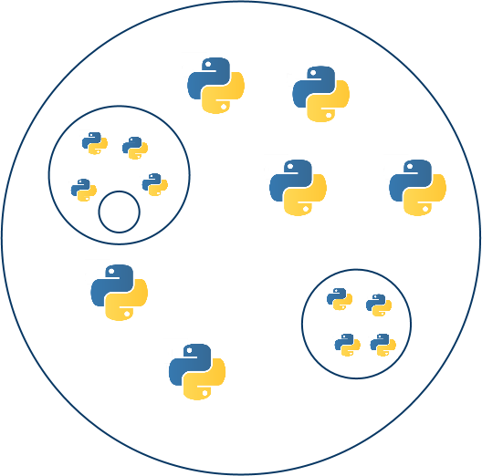
=====

Swarm-Like Agent Protocol in Python

Here you have SLAPP **v.3.0 build 20170524**, running in Python 3 (in the [SLAPP repository](http://terna.to.it/slapp_dep/) you have related material and very old versions; more recent ones are here in the Git; the 2.0.x version is the last one related to Python 2).

We have here also a [**Reference Handbook**](https://github.com/terna/SLAPP/blob/v.3.0/SLAPP_Reference_Handbook.pdf) (it is still a draft and has to be improved).

Five chapters of the book of Boero, R., Morini, M., Sonnessa, M., and Terna, P.,  [Agent-based Models of the Economy - From Theories to Applications](http://www.palgrave.com/page/detail/agentbased-models-of-the-economy-/?K=9781137339805), are related to SLAPP.

We have also the [SLAPP online 1](http://slapp-online.net:6789) (quite obsolete) and [SLAPP online 2](https://slapp.hopto.org:6789) running versions, aimed to simplify
the initial knowledge of SLAPP; write to *pietro.terna at unito.it* to obtain an access.

In October 2016 I taught a course on *Agent-Based Simulation* for the [Master in Data Science for Complex Economic Systems, MADAS](http://www.madas.carloalberto.org/) and for the [Vilfredo Pareto Doctorate in Economics](http://www.sde.unito.it/). I have introduced SLAPP both as a tutorial in agent-based programming and a simulation shell, with some comparative references to NetLogo. Look [here](http://terna.to.it/sim/2016/) for the contents and videos of the course; have also a preliminary look to the [_README.txt](http://terna.to.it/sim/2016/_README.txt) file.  
The file 2.mp4 of lesson 4 contains, from minute 41, a short introduction to the use of SLAPP online.

---
SLAPP logo: credits to [Steve Rogers](https://www.linkedin.com/in/shrogers).

---

How to start: a quick introduction
====
If you are interested in an **introduction to Agent-based programming** techniques in a general way, read the content of the file "SLAPP tutorial.txt" ; the tutorial shows the fundamental ideas of the [Swarm](http://www.swarm.org) project, i.e., the roots of the SLAPP construction; **NB**, to use SLAPP, it is not necessary to study this tutorial.

To start **running the agent-based shell**, read the content of the file
"SLAPP shell.txt" and install the required libraries (about library installation, above all look at the Appendix A of the Reference Handbook here in this same folder); then, via a terminal, go into the SLAPP main folder (that where you have unzipped SLAPP), and:

1 - launch the application "basic" as in the following window:

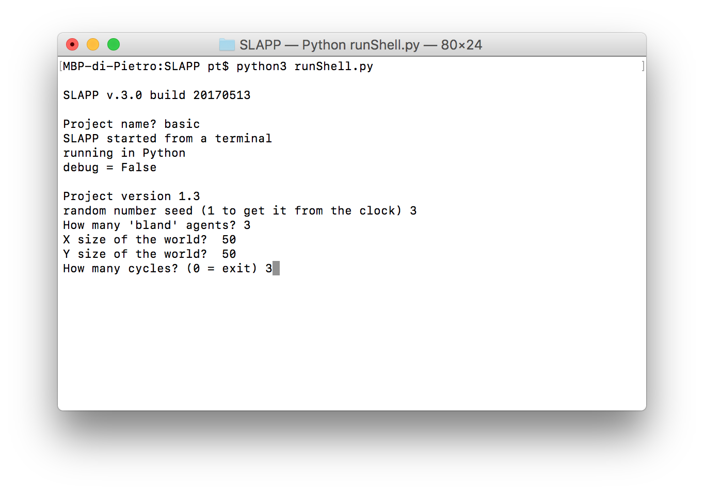

the effect is (plain text output only):

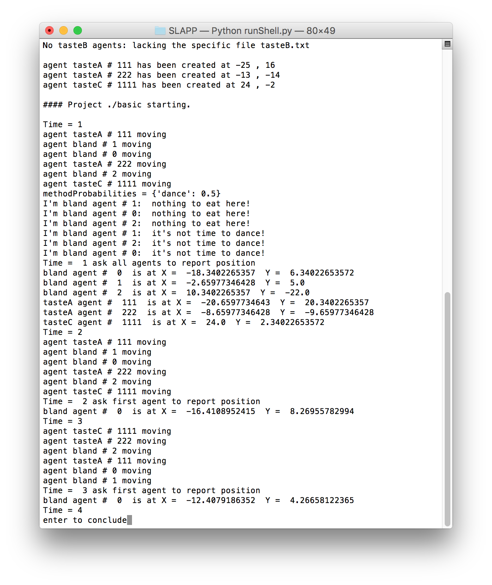

or

2 - launch the application "school" as in the following window:

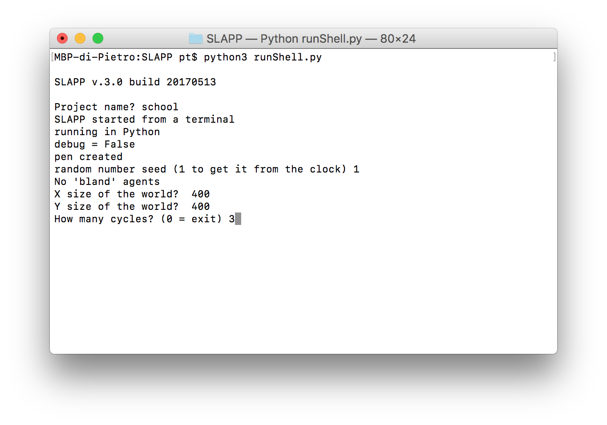

the effect is (plain text output):

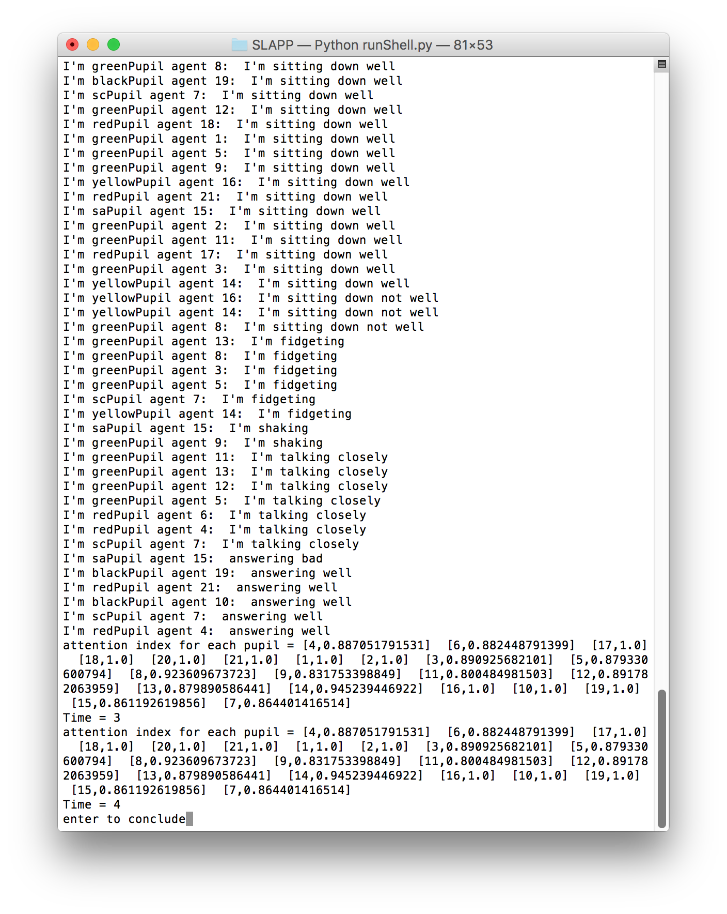

and as graphical output:

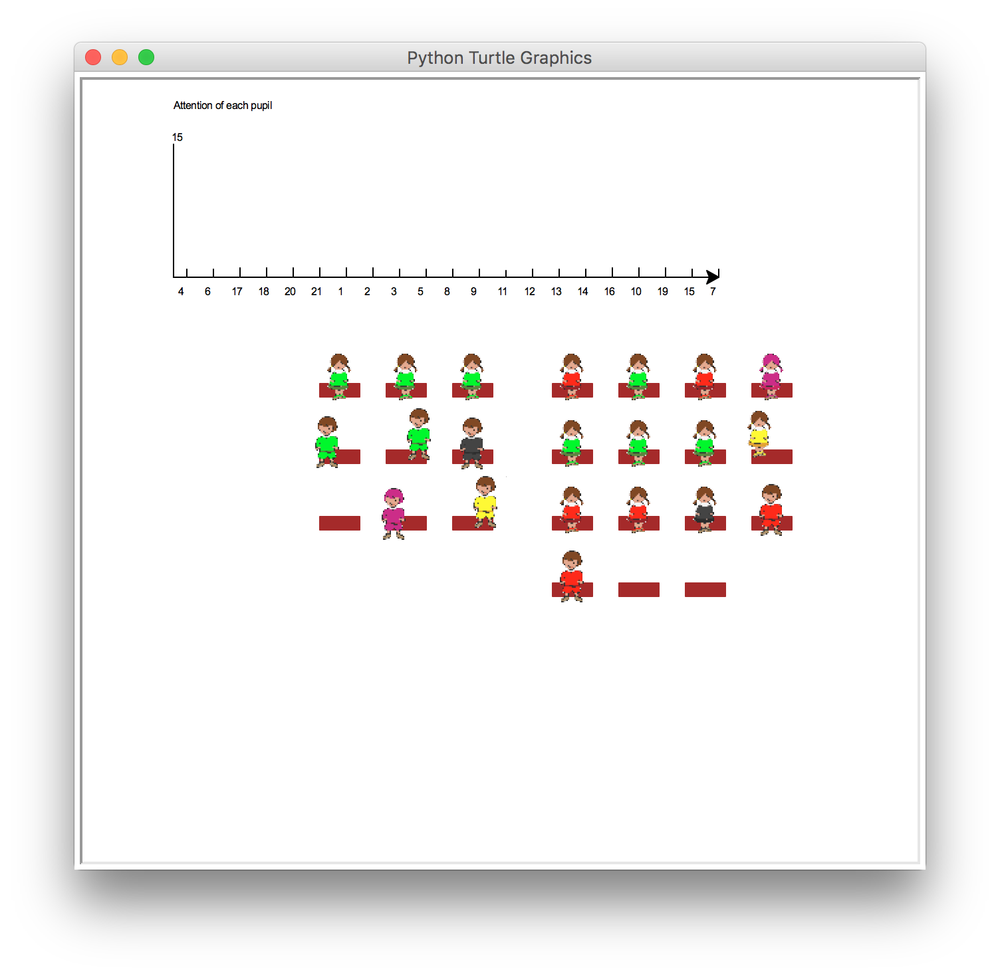

or

3 - launch the application "production" as in the following window:

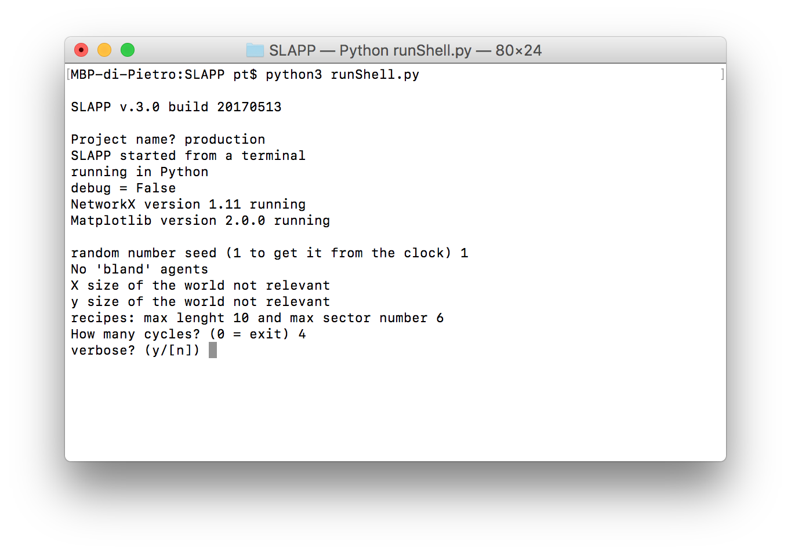

the effect is (plain text output):

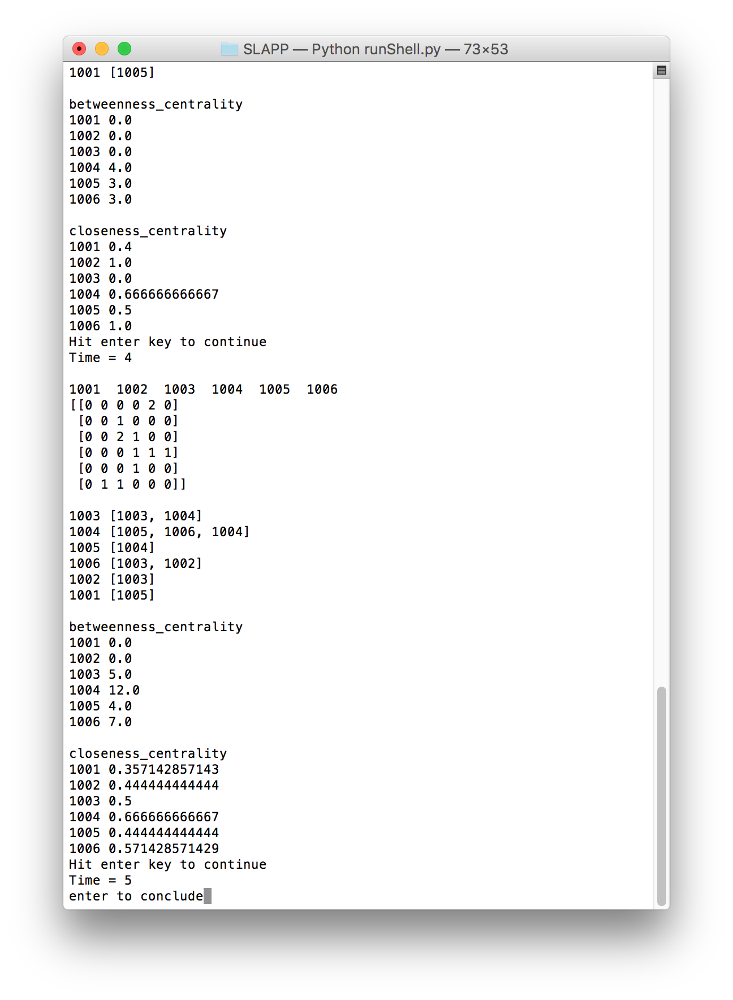

and as graphical output:

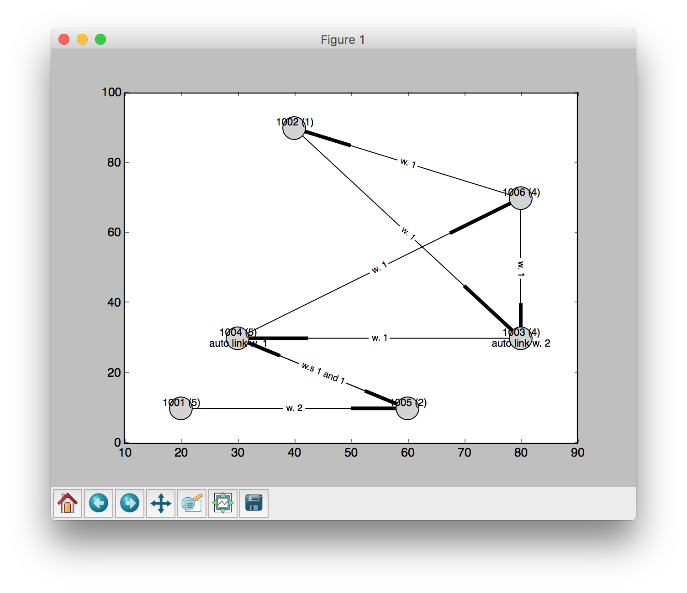

If you prefer to work with Python in a notebook&mdash;using (i) the [IPython](http://ipython.org) interactive version of Python or, better, (ii) the *agnostic language shell* named [Jupyter](http://jupyter.org)&mdash;via a terminal go into the main SLAPP folder (that where you have unzipped SLAPP) and launch Jupyter as below:

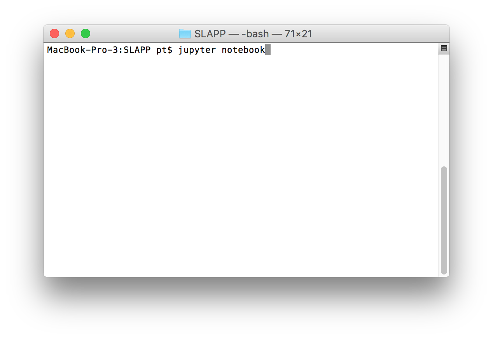

Then chose *iRunShell.ipynb* as in:

Finally, run the notebook placing the cursor in the first cell and  hitting the  key in the top bar (or entering Shift+Enter); then chose a project as in:

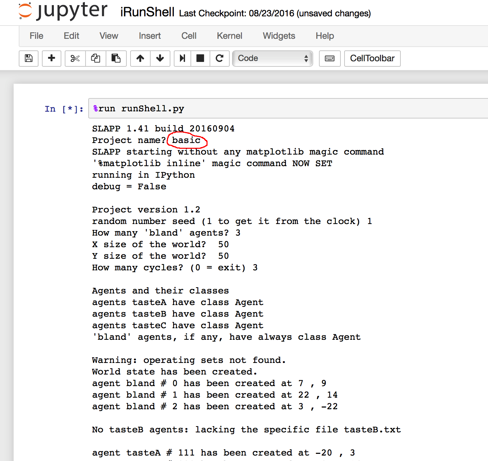

The results will be the same reported above in the non interactive presentation.

Please note that we have only a set of example. A good starting point about *running* SLAPP is the Reference Handbook, section **How to *run* SLAPP**.
